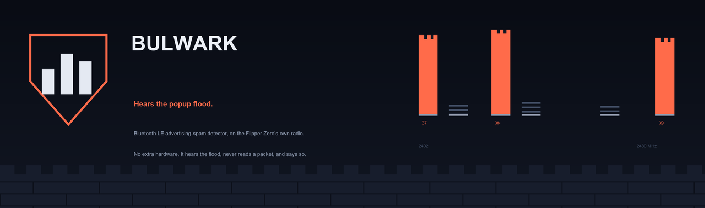
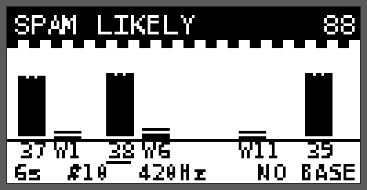
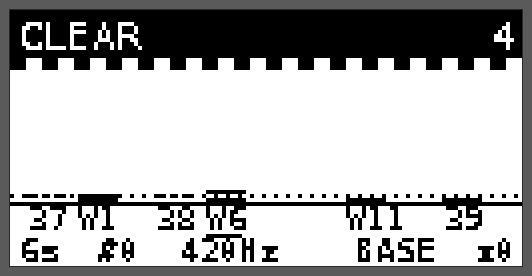
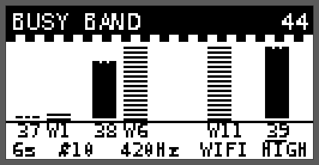
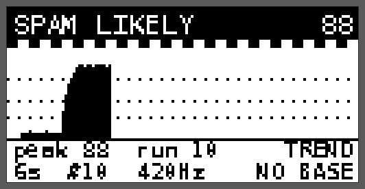
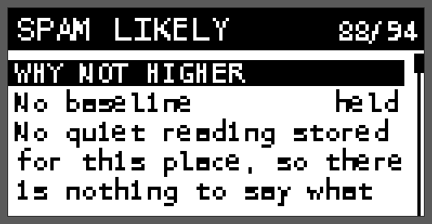
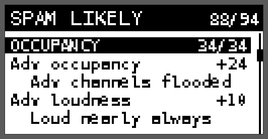
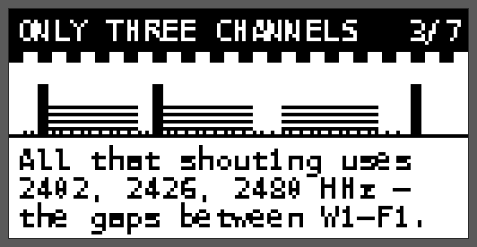

<p align="center">
  
</p>

<p align="center">
  
  
  
  
  
</p>

# Bulwark

**A Bluetooth LE advertising-spam detector that runs on the Flipper Zero's own radio.**

You know the attack even if you do not know its name. Someone in the carriage
has a board in their bag, and every iPhone within twenty metres starts asking
about AirPods it has never met, ten times a minute, until the phone is
unusable. On Android it is a pairing prompt for a keyboard that does not
exist. On Windows it is Swift Pair, over and over. The tooling to do it ships
on the Flipper itself, which is exactly why the defensive half is worth
building.

Bulwark is that half. It does not transmit anything. It listens to the three
frequencies the attack has to use, and tells you whether somebody is standing
on them.

---

## The idea

Every Bluetooth LE device that wants to be found — your earbuds, a fitness
band, a shop beacon, and a popup spammer — *advertises*: it shouts a short
packet several times a second so that phones can hear it. All of that shouting
happens on exactly three frequencies out of the forty the radio has:

| Advertising channel | Frequency | Sits between |
|---|---|---|
| 37 | 2402 MHz | below Wi-Fi 1 |
| 38 | 2426 MHz | Wi-Fi 1 and Wi-Fi 6 |
| 39 | 2480 MHz | above Wi-Fi 11 |

Those three were chosen in the 1990s to dodge the centres of Wi-Fi channels 1,
6 and 11, which is why your earbuds still connect in a room full of Wi-Fi.
That accident of spectrum politics is the entire basis of this app.

Bulwark parks the Flipper's radio on those three channels **and** on the three
Wi-Fi centres between them, hops between all six for a few seconds, and
measures how much of the time each one is busy. Then it asks one question:

> Is the *advertising* busy, or is the *band* busy?

A spam attack fills 2402, 2426 and 2480 MHz in roughly equal measure, from
close range, without stopping. Nothing else in 2.4 GHz does that — those three
frequencies have nothing in common except Bluetooth. A microwave oven cannot
touch 2402 MHz. A Wi-Fi access point favours whichever channel it is on. A
video sender is a single wide lump. Only advertising lights up all three.

---

## What it looks like

| Somebody is flooding the band | A room that is fine | A microwave oven, one wall away |
|---|---|---|
|  |  |  |
| All three towers up, Wi-Fi flat. | Everything at the dotted baseline. | 2402 MHz untouched — so not Bluetooth. |

The six bars sit at their real spacing across 2402–2480 MHz, so the picture is
a picture of the band. The three advertising channels are solid; the Wi-Fi
centres are drawn as texture, because they are context rather than evidence.
The dotted line is the baseline you stored for this place. The underlined
label is the channel the radio is parked on right now.

| Is it following me? | Why it is not higher | The whole breakdown |
|---|---|---|
|  |  |  |
| One column per sweep. | The ceiling that bit, named. | Every signal, and what it was worth. |

<p align="center">
  <br>
  <em>Seven panels on how the attack works, why the Flipper can hear it, and how to turn the popups off.</em>
</p>

---

## How it decides

Four independent families of evidence, seven signals, one hundred points
before any ceiling is applied.

| Family | Max | What it is |
|---|---|---|
| **OCCUPANCY** | 34 | How much of the time the advertising channels are busy, and how loudly. |
| **SHAPE** | 30 | Whether the busyness is *Bluetooth-shaped*: all three channels equally, and not the Wi-Fi centres. |
| **LEVEL** | 20 | How far the loudest arrivals rise above the band floor. Proximity plus transmit power. |
| **PERSISTENCE** | 16 | Whether it is still there sweep after sweep. |

### The ceilings are the design

This is the part that matters. Every one of them is a refusal to overclaim,
and the breakdown screen names the one that actually held the score down.

| Ceiling | When | Why |
|---|---|---|
| **20** | OCCUPANCY scored nothing | A quiet band cannot be an attack, whatever shape it is. |
| **30** | Wi-Fi centres twice as busy as advertising | That is Wi-Fi. Bulwark cannot see through it, and says so. |
| **30** | No busier than your stored baseline | This is what this place is like. |
| **44** | SHAPE scored nothing | Ovens, video senders and crowded Wi-Fi all make the band busy. None of them is advertising at your phone. |
| **64** | First sweep | One look is not a watch. |
| **65** | Wi-Fi centres as busy as advertising | A 20 MHz Wi-Fi channel does reach these frequencies. Could be either. |
| **69** | No tri-channel signature | **SPAM LIKELY requires it specifically.** Every other signal here has an innocent explanation on its own. |
| **88** | No baseline stored | Nothing to say what normal looks like where you are. |
| **94** | Always | Bulwark cannot read a packet. It never reaches certainty. |

Verdicts: **CLEAR** (0–24) · **BUSY BAND** (25–44) · **SUSPECT** (45–69) ·
**SPAM LIKELY** (70–94).

Wi-Fi interference is reported *separately* from the score, because "I cannot
see" and "I see nothing" are different sentences.

---

## What it cannot do, on the same page as what it can

To listen at all, the radio has to be put into the RF test mode meant for
factory calibration. In that mode it measures energy and **decodes nothing**.
So Bulwark:

- never sees a Bluetooth address, so it cannot count devices or track one;
- never sees a device name or payload, so it cannot tell you *which* spam
  family it is — Apple Continuity, Fast Pair, Swift Pair, EasySetup all look
  identical to it;
- cannot tell an attack from a shop with sixty beacons in the ceiling. That
  case is in the demo set, it scores SPAM LIKELY, and the app says so.

It also **never says a place is safe**. An attacker three rooms away still
reaches a phone in a pocket that Bulwark cannot hear from the table it is
sitting on. It reports what arrived at its own antenna, in the seconds it was
listening. That is the claim, and it is the only one.

While Bulwark is listening, the Flipper's own Bluetooth is off. It is put back
when you leave the watch screen.

---

## Take a baseline

The single most useful thing you can do. One sweep, somewhere you trust,
standing where you will be standing. Bulwark stores it and from then on knows
what *your* places sound like — the dotted line on the wall screen — instead
of guessing at what a normal place sounds like in general.

Without one, every verdict is capped at 88 and the breakdown says why.

---

## Using it

| Key | |
|---|---|
| **Left / Right** | wall page ↔ trend page |
| **OK** | the full breakdown |
| **Hold OK** | throw the session away and start again |
| **Back** | stop listening, give the Flipper its Bluetooth back |

Settings: sweep length (3 / 6 / 12 seconds), alerts, CSV logging, backlight,
and a **demo band** — seven synthetic places that run through the identical
statistics and scoring engine with no hardware involved. The screen says
`DEMO` the whole time one is selected.

Alerts are meant for a Flipper you are not looking at: SUSPECT is a rising
pair of notes, SPAM LIKELY is three notes, the buzzer and the red LED.

### The log

With logging on, every sweep appends a row to
`/ext/apps_data/bulwark/sweeps.csv` — verdict, score, the ceiling that bit,
per-channel occupancy, floor, peak, sample count and achieved sample rate. The
arithmetic can be checked in a spreadsheet by somebody who does not trust the
app.

---

## Install

Grab `bulwark.fap` from the [latest release](https://github.com/at0m-b0mb/Bulwark-FlipperZero/releases)
and drop it in `/ext/apps/Bluetooth/` on the SD card. It appears under
**Apps → Bluetooth → Bulwark**.

### Build it yourself

```bash
python3 -m pip install --upgrade ufbt
ufbt update --channel=release
ufbt
```

The `.fap` lands in `dist/`. `ufbt launch` builds and runs it on a connected
Flipper.

---

## The engine is tested, not screenshotted

Everything on the screen is a rendering of what `bw_stats` and `bw_score_eval`
decided, and a screenshot cannot vouch for any of it. So the measurement and
scoring code is `furi`-free and compiled for the host, where **8.3 million
checks** run on every push:

```bash
make -C test
```

Among them: the histogram percentiles are checked against a brute-force sort;
every ceiling in the table above is checked as an invariant over 200,000
randomised inputs; `SPAM LIKELY` is proven to be unreachable without the
tri-channel signature and without a second sweep; and more evidence is proven
never to lower a score.

The README screenshots are drawn by `tools_gen_mockups.py` from
`test/demo_dump.json`, which the real engine writes. The numbers on those
screens are numbers the engine produced.

```bash
make -C test dump && python3 tools_gen_mockups.py
```

---

## Layout

```
bulwark.c                 app shell, alerts, session state
helpers/bw_chan.*         the six frequencies and why they are those six
helpers/bw_stats.*        RSSI samples -> a description of the band   (furi-free)
helpers/bw_score.*        families, signals, ceilings, verdict        (furi-free)
helpers/bw_demo.*         seven synthetic bands                       (furi-free)
helpers/bw_radio.*        the worker: RF test mode, channel hopping
helpers/bw_store.*        settings, the stored baseline, the CSV log
views/wall_art.*          ramparts, shields and the six-channel spectrum
views/watch_view.*        the screen you actually watch
views/detail_view.*       the whole of the reasoning
views/learn_view.*        seven animated panels
test/                     the host test suite
```

---

## Legal and sensible

Bulwark is a receiver. It transmits nothing and connects to nothing. Passive
observation of the 2.4 GHz ISM band is unregulated in essentially every
jurisdiction, but the advice a defensive tool should give is the boring one:
use it on your own behalf, in places you are entitled to be.

The popups themselves are a nuisance attack, not a compromise — nothing is
being read off your phone. The fix is in the last panel of the walkthrough.

---

## Licence

MIT. See [LICENSE](LICENSE).

Built by [at0m-b0mb](https://github.com/at0m-b0mb).
